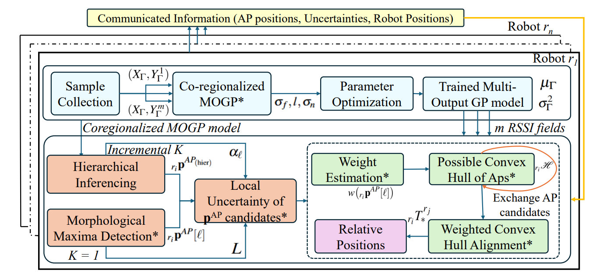

# MGPRL

This repository contains the ROS package that implements the works from the algorithm "MGPRL: Distributed Multi-Gaussian Processes for Wi-Fi-based Multi-Robot Relative Localization in Large Indoor Environments". The following figure shows the conceptual overview of MGPRL:




### Experimental Demonstration and Video


## Requirements & Environment Setup
The package has been tested on ROS Noetic for both simulated and hardware Turtlebot3 robot (waffle) & Turtlebot2 (2e and 2i). The following requirements are needed before installing the package:

1. **ROS Installation**: You should have installed a ROS distribution (Noetic) on Ubuntu 20.04.
2. **Workspace Creation**: Make sure you have created a ROS workspace. You can follow the ROS [tutorial](http://wiki.ros.org/catkin/Tutorials/create_a_workspace) to do this.
3. **Install `rtabmap` &  `kimera-multi` ROS Packages **: Install the `rtabmap` and  `kimera-multi` package with the following command:
    ```bash
    sudo apt-get install ros-noetic-rtabmap-ros
    mkdir -p catkin_ws/src
    cd catkin_ws/src/
    git clone git@github.com:MIT-SPARK/Kimera-Multi.git kimera_multi
    sudo bash kimera_multi/install/dependencies.sh
    vcs import . --input kimera_multi/kimera_multi.repos --recursive
    cd ..
    catkin config -a --cmake-args -DCMAKE_BUILD_TYPE=RelWithDebInfo -DGTSAM_TANGENT_PREINTEGRATION=OFF -DGTSAM_BUILD_WITH_MARCH_NATIVE=OFF -DOPENGV_BUILD_WITH_MARCH_NATIVE=OFF
    catkin build --continue -s
    ```
4. **Install ROS Navigation Stack**: You can install the ROS navigation stack using the following command:
    ```bash
    sudo apt-get install ros-noetic-navigation
    ```
6. **Python Modules Installation**: Make sure python version is 3.8+. Install the following Python modules using `pip`:
    ```bash
    pip install numpy pandas matplotlib open3d opencv-python scikit-learn
    ```
7. **Turtlebot3 Installation**:
    ```bash
    cd ~/catkin_ws/src/
    git clone https://github.com/ROBOTIS-GIT/turtlebot3_simulations.git
    echo "export TURTLEBOT3_MODEL=waffle" >> ~/.bashrc
    source ~/.bashrc
    sudo apt-get install ros-noetic-turtlebot3*
    ```
    
8. **AWS Gazebo Worlds Installation**:
    ```bash
    cd ~/catkin_ws/src/
    https://github.com/aws-robotics/aws-robomaker-small-house-world.git
    https://github.com/aws-robotics/aws-robomaker-bookstore-world.git
    ```

9. **Move_Base Navigation**:
    ```bash
    sudo apt-get install ros-$ROS_noetic-move-base
    ```
10. **Environment Initialization**:
    ```bash
    cd ~/catkin_ws/src/
    git clone https://github.com/herolab-uga/SPACE-MAP.git
    catkin_make
    source devel/setup.bash
    ```

## ROS Nodes
## ROS Topics
## Launch
## Contributions

- **Sai Krishna Ghanta** - PhD Candidate
- **Dr. Ramviyas Parasuraman** - Lab Director

### [Heterogeneous Robotics Lab](https://hero.uga.edu/)
School of Computing, University of Georgia.


For further information, please contact Dr. Ramviyas Parasuraman at [ramviyas@uga.edu](mailto:ramviyas@uga.edu). 

